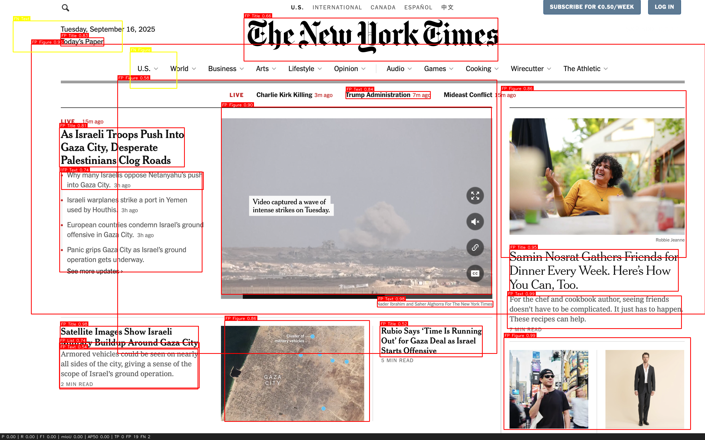

## Build and run

```sh
make build
make run
make wait
```

## One-shot evaluate (prints metrics and writes compare.png)

```sh
make evaluate
```

Use your own files (overrides):

```sh
make evaluate EVAL_IMG=/absolute/path/to/your_image.png EVAL_ANN=/absolute/path/to/your_annotations.json IOU=0.5
```

## Dlaczego wybrane metryki

- **Precision, Recall, F1**: dobrze oddają jakość detekcji przy nierównych klasach; F1 daje jeden wskaźnik do szybkiego porównania.
- **TP/FP/FN**: surowe zliczenia ułatwiają debugowanie (czego brakuje vs. co jest nadmiarowe).
- **mean IoU**: mierzy dokładność lokalizacji sparowanych ramek; uzupełnia F1 (które nie mówi, jak dobrze pasują ramki).
- **AP@0.5**: podsumowuje zależność precision–recall w funkcji progu pewności przy standardowym IoU=0.5; szybkie i powszechne wstępne kryterium (zamiast cięższego COCO mAP@[.5:.95]).
- **IoU=0.5 (domyślnie)**: rozsądne dla dokumentów, ale można zacieśnić (np. 0.6–0.75) parametrem `iou_threshold`.
- **Dopasowanie etykiet**: trafienie liczone tylko przy zgodnym typie (np. Text vs Table), żeby ocena odzwierciedlała semantykę, nie tylko geometrię.

## Podgląd wyników



## Jak działa rozwiązanie

- Aplikacja to serwis FastAPI w kontenerze Docker.
- Wykrywanie layoutu korzysta z `layoutparser` + Detectron2 (model PubLayNet Faster R-CNN R50-FPN). Wagi są pobierane w trakcie budowania obrazu.
- `POST /detect/` wykonuje detekcję i zwraca:
  - listę wykrytych elementów (JSON) i/lub obraz z naniesionymi ramkami (PNG/base64).
- `POST /evaluate/` uruchamia detekcję, porównuje z adnotacjami referencyjnymi (COCO lub prosty JSON) i zwraca:
  - metryki (precision, recall, F1, mean IoU, AP@0.5, TP/FP/FN),
  - obraz porównawczy (GT vs pred: kolory jak w README).
- Uruchomienie na CPU domyślnie; na macOS włącza się MPS, jeśli dostępne.
- ZASTRZEŻENIE: nie przygotowywałem własnych adnotacji

## Dokumentacja endpointów

- `GET /health` – sprawdzenie dostępności serwisu.

- `POST /detect/`
  - Zapytanie: multipart/form-data
    - `file` – obraz PNG/JPEG
    - `format` (query): `json` | `image` | `both` (domyślnie `json`)
  - Odpowiedź:
    - `json`: `{ "detections": [{"x_1","y_1","x_2","y_2","type","score"}, ...] }`
    - `image`: PNG z narysowanymi ramkami
    - `both`: JSON + pole `image_base64` (PNG zakodowany base64)
  - Przykład:
    ```sh
    curl -sS -X POST "http://localhost:8000/detect/?format=both" \
      -F "file=@app/data/example_data.png"
    ```

- `POST /evaluate/`
  - Zapytanie: multipart/form-data
    - `file` – obraz PNG/JPEG
    - `annotations` – JSON z adnotacjami (COCO lub prosty format)
    - `iou_threshold` (query): float w [0,1], domyślnie 0.5
    - `format` (query): `json` | `image` | `both` (domyślnie `json`)
  - Odpowiedź:
    - `json`: `{ "metrics": { "precision", "recall", "f1", "mean_iou", "ap50", "tp", "fp", "fn" } }`
    - `image`: PNG porównawczy
    - `both`: JSON z `metrics` + `image_base64`
  - Przykład:
    ```sh
    curl -sS -X POST "http://localhost:8000/evaluate/?format=both&iou_threshold=0.5" \
      -F "file=@app/data/example_data.png" \
      -F "annotations=@app/data/example_coco.json;type=application/json"
    ```

